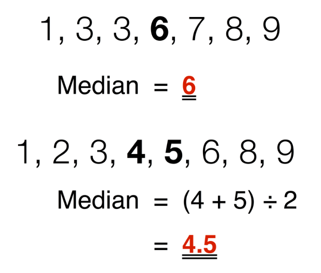

# Median (p81) 📚

The _Median_ refers to the _'middle value'_ in a sorted list.

- If the list contains an _'odd number'_ of items, the _Median_ has an equal number of items on either side of it. 

- If there is an _'even number'_ of items in the list, the _Median_ is the average of the two middle numbers.

 

## Finding the median - manual method 👨‍💻 

1. Follow the instruction on page 81 - 82 and see if you can get your code to work correctly.
2. Use the sections given in `main.py` to separate your code.
3. Use `# comments` to help explain what your code is doing.

````py
# -------------------------------------
# 3. Finding the median - manual method

myList = [1,19,27,8,5,9]

myList2 = [1,19,27,11,8,5,9]

````

### 💡 _Note:_ 

We are using two lists, `myList` and `myList2`.
- `myList` is for an _'even number'_ of items.
- `myList2` is for an _'odd number'_ of items.

## Finding the median - statistics module 👨‍💻 

1. Follow the instruction on page 82 and see if you can get your code to work correctly.
2. Use the sections given in `main.py` to separate your code.
3. Use `# comments` to help explain what your code is doing.

````py
# -----------------------------------------
# 3. Finding the median - statistics module

myList = [1,19,27,8,5,9]

myList2 = [1,19,27,11,8,5,9]

````


