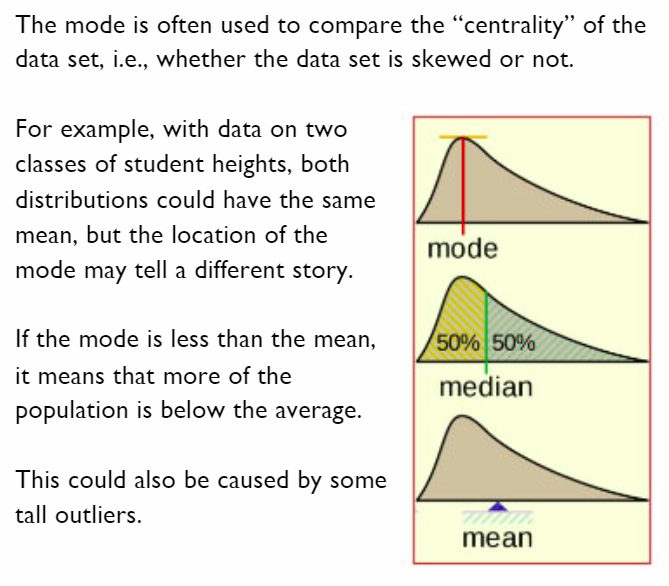
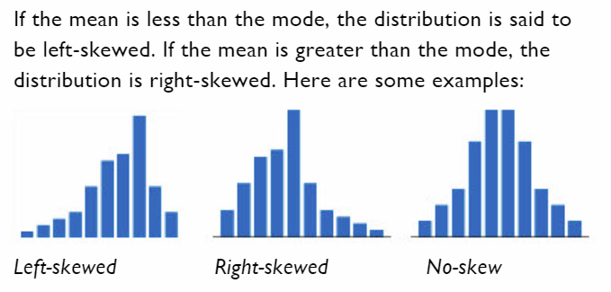

# Mode (p83) 📚

The _Mode_ is the value that occurs most often in a data set.
- The _distribution_ of a data set refers to the spread of its values.
- A _distribution_ is said to be _skewed_ when it has a longer _'tail'_ on one side compared to the other.






## Finding the mode - manual method 👨‍💻 

1. Follow the instruction on page 83 and see if you can get your code to work correctly.
2. Use the sections given in `main.py` to separate your code.
3. Use `# comments` to help explain what your code is doing.

````py
# -----------------------------------
# 5. Finding the mode - manual method

````


## Finding the mode - statistics module 👨‍💻 

1. Follow the instruction on page 83 and see if you can get your code to work correctly.
2. Use the sections given in `main.py` to separate your code.
3. Use `# comments` to help explain what your code is doing.

````py
# ---------------------------------------
# 5. Finding the mode - statistics module
````
