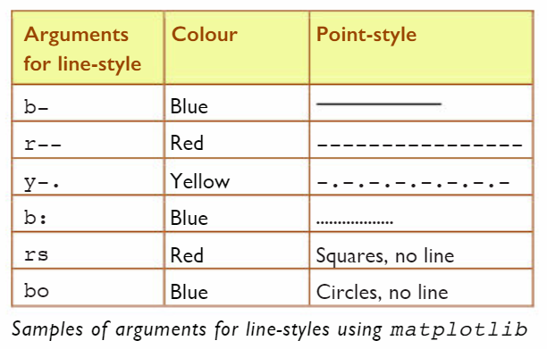

# Visualisation Options 📚

We may not always want a line graph.

- For example, a line between points suggests that they are linked in some way, but that may not be the case.
- The following code plots the points without any connecting lines.
- The _'line style'_ is the second argument.
````py
ply.plot(numBS, "rs")
````

👉 Edit the code from the previous page and see how your output changes.

💡 _Note: the arguments for line style typically consist of 2-3 characters._

- The first represents the colour.
- The second/third represent the line style.
- The default line style is `b-`.

Example of line style arguments:

 


👉 Experiment with the arguments above and see how it affects your plot.


