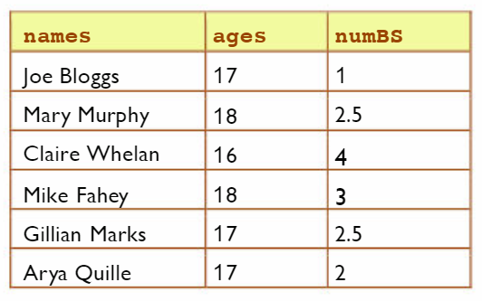

# Working with x-axis and y-axis 📚

We saw earlier that `pyplot` automatically uses the index of the list as the x-axis values if we don't provide any.

- Look at the table below which we saw earlier in Chapter 3.
- We want to plot `numBS`, the number of brothers and sisters each student has.

💡 _Note: `numBS` has two input values._



👉 Can you figure out a way to show the names of the students on the x-axis of your plot.

<details>
  <summary> Hint 👀</summary>
Try using 2 lists...

````py
numBS = [1,2.5,4,3,2.5,2]
names = ["Joe Bloggs","Mary Murphy","Claire Whelan","Mike Fahey","Gillian Marks","Arya Quille"]
````
You can use your textbook _(page 86)_ to build the solution.
</details>


