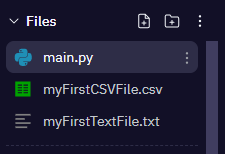

# Accessing Data 📚

In this section we will write Python code to read in, store and retrieve data from files stored in your machine.

## Part A 👨‍💻
Creating, writing to and closing a ``.txt`` file.

## Part B 👨‍💻
Creating, writing to and reading a ``.csv`` file. 

## Steps
1. Follow the instructions laid out in pages 74 - 76 and see if you can understand how to _create, read from / write to_, different file types.
2. Use the `#commments` provided to help you lay out your code.
3. Run your code to check that it functions properly.
4. Notice that the following files should appear beneath `main.py`

 

  